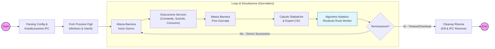
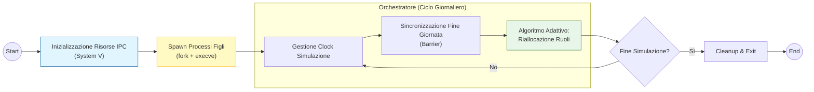
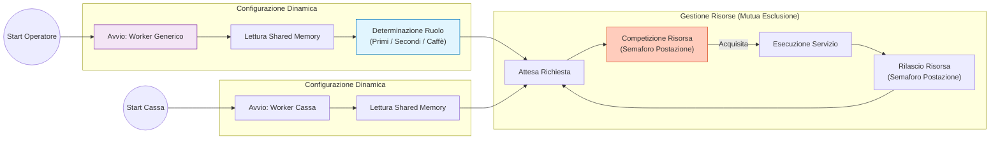
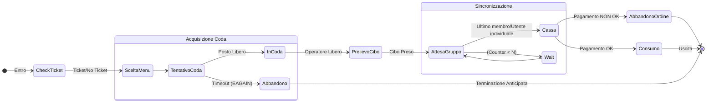
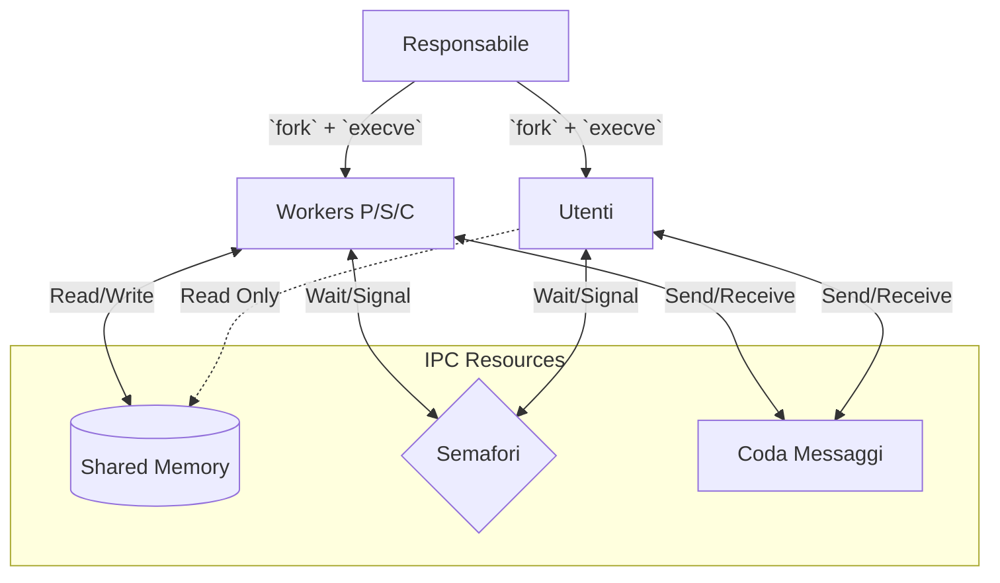
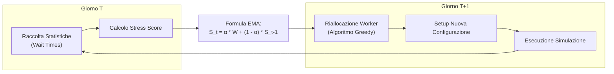
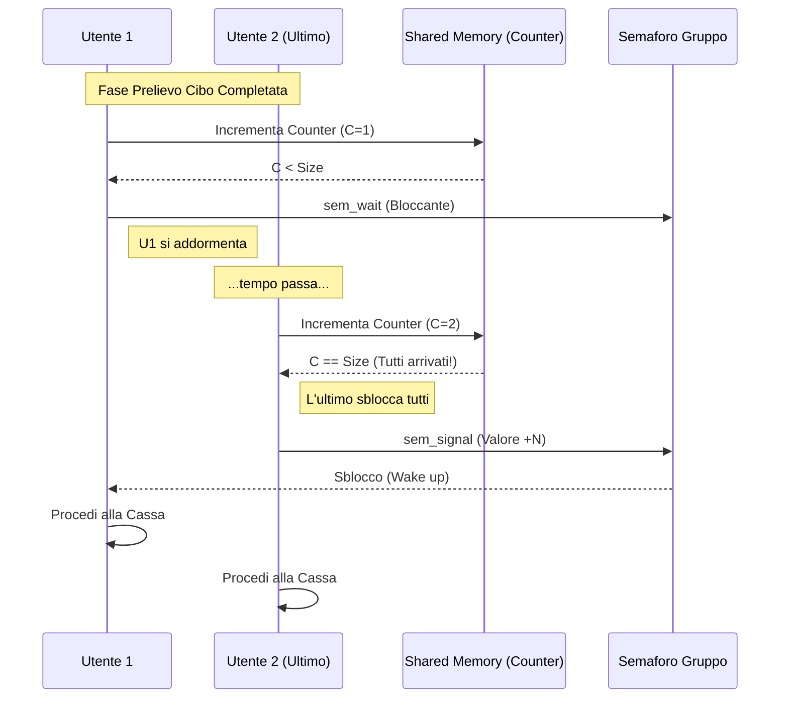
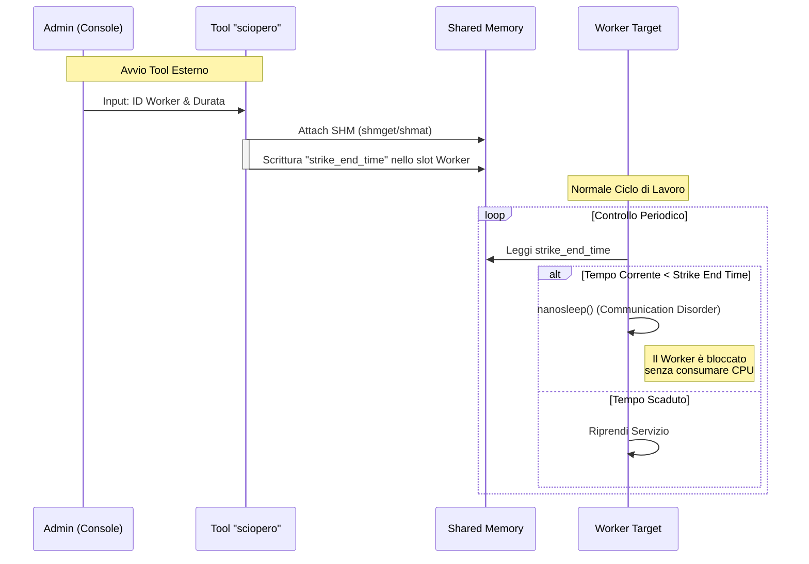
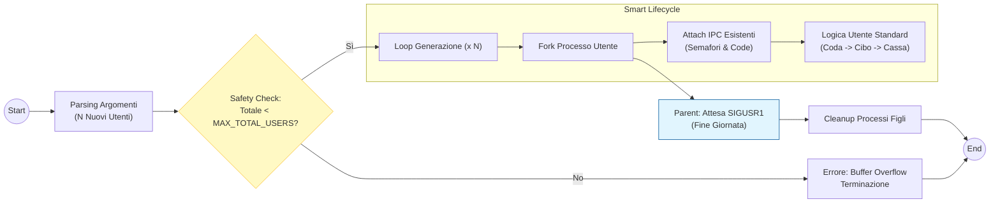
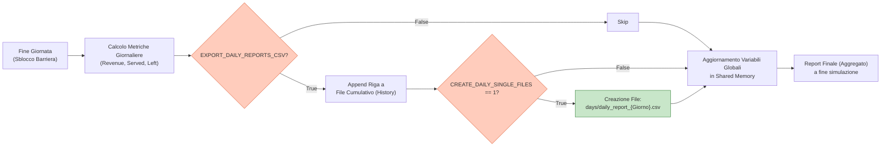

# Relazione Tecnica: Progetto "Oasi del Golfo"

**Corso:** Sistemi Operativi 2025/2026
**Autore:** André Marguerettaz
**Matricola:** 1152060
**Repository GitHub:** [https://github.com/l0gic5/servizio_mensa](https://github.com/l0gic5/servizio_mensa)

---

## Dichiarazione sull'uso di strumenti di AI Generativa

In conformità con le linee guida del progetto, si dichiara che per lo sviluppo di questo elaborato è stato fatto uso di Large Language Models (LLM). Tali strumenti sono stati utilizzati principalmente come supporto per:

* L'analisi delle scelte architetturali e dei pattern di sincronizzazione IPC.
* La stesura e la validazione dei test unitari (tramite framework *Unity*).
* Il debugging avanzato e l'ottimizzazione delle Makefile rules.

Tutta la logica di **business**, la **gestione dei processi** e l'**implementazione degli algoritmi adattivi** sono state supervisionate e finalizzate dallo studente.

---

## 1) Introduzione e Obiettivi

Il progetto "Oasi del Golfo" consiste nella simulazione concorrente di un servizio di mensa aziendale/universitaria. L'obiettivo principale è modellare l'interazione complessa tra risorse limitate (cibo, postazioni di lavoro, tavoli) e attori indipendenti (utenti e operatori), gestendo le criticità tipiche dei sistemi operativi: sincronizzazione, mutua esclusione, deadlock avoidance e gestione dei segnali.

Il sistema è progettato per essere **adattivo**: monitora le performance giornaliere e riconfigura le risorse per il giorno successivo, simulando un ambiente gestionale dinamico e resiliente.

---

## 2) Architettura del Sistema

L'applicazione è sviluppata in linguaggio C (standard C99) per ambiente Linux, seguendo rigorosamente la filosofia Unix: ogni entità attiva nella simulazione corrisponde a un processo indipendente del sistema operativo.



### 2.1) Modello dei Processi

Il ciclo di vita della simulazione è orchestrato gerarchicamente:

1. **Processo Master (`responsabile`)**:
     * Agisce come genitore e orchestratore.
     * Inizializza le risorse IPC (System V).
     * Effettua il *fork* ed *execve* di tutti i processi figli.
     * Gestisce il clock della simulazione e la sincronizzazione di fine giornata (Barrier).
     * Esegue l'algoritmo di riallocazione dei ruoli (descritto nella Sez. 4).



2. **Processi Worker (`operatore` e `cassa`)**:
      * Simulano il personale della mensa.
      * Sono generici all'avvio: il loro ruolo (Primi, Secondi, Caffè) è determinato dinamicamente leggendo la *Shared Memory*.
      * Competono per l'acquisizione delle risorse "Postazione" tramite semafori.



1. **Processi Client (`utente`)**:
      * Simulano il comportamento dei clienti.
      * Implementano una macchina a stati finiti: *Scelta Menu -> Coda -> Ordine -> Attesa Gruppo -> Pagamento -> Consumo*.
      * Gestiscono autonomamente i timeout (impazienza) e la rinuncia al servizio in caso di congestione.



### 2.2) Gestione delle Risorse IPC

La comunicazione e la sincronizzazione tra processi avvengono esclusivamente tramite primitive **System V IPC**, garantendo l'**assenza** di *busy waiting*:

* **Shared Memory (`shmget`/`shmat`):** Utilizzata per condividere lo stato globale della cucina, le statistiche di performance e la configurazione dinamica dei ruoli. L'accesso è strettamente protetto da semafori mutex.
* **Message Queues (`msgget`/`msgsnd`):** Implementano il canale di comunicazione asincrono tra Utenti e Operatori per l'invio delle comande e la ricezione dello stato dell'ordine.
* **Semaphores Array (`semget`/`semop`):** Gestiscono tre aspetti critici:
  1. **Mutex:** Protezione delle sezioni critiche in Shared Memory.
  2. **Counting Semaphores:** Gestione delle code di attesa (capacità limitata) e delle risorse fisiche (tavoli, postazioni).
  3. **Barriere:** Sincronizzazione di gruppo (utenti che mangiano insieme) e sincronizzazione globale di fine giornata.

### 2.3) Schema Logico

*In questa sezione è riportato il diagramma di flusso che illustra le interazioni tra i processi e l'uso delle risorse IPC.*



---

## 3) Gestione della Concorrenza e IPC

La correttezza del simulatore si basa su una rigorosa gestione delle risorse condivise e sulla prevenzione di condizioni di *race condition* e *deadlock*.

Di seguito sono descritte le strategie adottate.

### 3.1) Sincronizzazione e Mutua Esclusione

L'accesso alla memoria condivisa (*Shared Memory*) è regolato tramite semafori System V utilizzati come **Mutex** binari.

* **Protezione Statistiche Globali:** Il semaforo `SEM_INDEX_MUTEX_STATS` garantisce che l'aggiornamento dei contatori (es. `total_revenue`, `daily_users_served`) avvenga in modo atomico.

  Ogni processo (Cassa, Operatore, Responsabile) esegue una `sem_wait` prima di scrivere e una `sem_signal` immediatamente dopo, minimizzando la durata della *Critical Section*.
* **Barriere di Sincronizzazione:**
  * **Inizio Giornata:** Un semaforo dedicato (`SEM_INDEX_DAY_CHANGE`) agisce come barriera di avvio, sbloccando simultaneamente tutti i processi Utente solo dopo che il Responsabile ha completato il setup della cucina e la riconfigurazione dei ruoli.
  * **Fine Giornata:** Per garantire la coerenza dei report giornalieri, il Responsabile attende che tutti i processi attivi abbiano concluso le operazioni correnti tramite una barriera di sincronizzazione (`SEM_INDEX_BARRIER`). Questo evita la lettura di dati parziali o corrotti durante la generazione del report.

### 3.2) Strategie di Deadlock Avoidance

Uno dei rischi maggiori in sistemi con risorse limitate è il *Deadlock* (stallo) o la *Starvation* (attesa indefinita). Per mitigare questi rischi, è stata adottata una strategia basata sui **Timeout**:

* **Code con Timeout ([`semtimedop`](https://www.gnu.org/software/gnulib/manual/html_node/semtimedop.html)):** A differenza della classica `semop` bloccante, l'ingresso nelle code di servizio (Primi, Secondi, Cassa) utilizza la syscall `semtimedop` (estensione GNU).
  * Se un utente non riesce ad acquisire la risorsa "posto in coda" entro `USER_QUEUE_TIMEOUT_SEC`, la chiamata fallisce con errore `EAGAIN`.
  * L'utente intercetta l'errore e abbandona la coda, rinunciando al servizio invece di rimanere bloccato indefinitamente. Questo simula realisticamente l'impazienza del cliente e previene il blocco del sistema in caso di *Overload*.

    ```c
    struct timespec timeout = {USER_QUEUE_TIMEOUT_SEC, 0};
    struct sembuf sb = {sem_index, -1, 0};

    // tentativo di accesso con timeout gestito dal kernel
    if (semtimedop(sem_id, &sb, 1, &timeout) == -1) {
      if (errno == EAGAIN) {
        LOG_WARN("Timeout coda scaduto, l'utente abbandona.");
        return -1;
      }
    }
    ```

### 3.3) Gestione dei Segnali e Robustezza

Il sistema è progettato per gestire in modo controllato sia il normale flusso operativo che la terminazione imprevista.

* **Gestione `SIGUSR1`:** Utilizzato come segnale di controllo interno per notificare ai processi figli eventi asincroni come il "Cambio Giorno", permettendo loro di uscire da stati di attesa (es. `nanosleep` o `pause`) e sincronizzarsi con il Responsabile.
* **Cleanup delle Risorse (`SIGINT`/`SIGTERM`):** Tutti i processi registrano *handler* specifici per intercettare i segnali di terminazione. In caso di arresto forzato (es. CTRL+C), viene eseguita una procedura di *cleanup* che:
  1. Esegue il `detach` dalla memoria condivisa.
  2. (Solo per il Responsabile) Rimuove attivamente semafori e code messaggi tramite `ipcrm` programmatico.
  3. Termina gerarchicamente tutti i processi figli per evitare processi "zombie" o orfani.

---

## 4) Dettagli Implementativi e Algoritmi

Il sistema implementa logiche avanzate per l'ottimizzazione delle risorse e la gestione dei flussi utente. Di seguito sono dettagliati gli algoritmi principali.

### 4.1) Algoritmo Adattivo di Riallocazione (Smart Rebalancing)

Per massimizzare l'efficienza del servizio (`throughput`), il processo Responsabile non utilizza una distribuzione statica dei lavoratori, ma applica un algoritmo di controllo a feedback basato sullo storico delle prestazioni.

L'algoritmo analizza i tempi medi di attesa ($W$) registrati per ogni categoria di servizio (Primi, Secondi, Caffè) e calcola una previsione di carico per il giorno successivo utilizzando una **Media Mobile Esponenziale (EMA - Exponential Moving Average)**. Questo approccio permette di adattare la forza lavoro ai trend recenti, filtrando i picchi di carico isolati (rumore statistico).

La formula utilizzata per l'aggiornamento dello "stress score"  di ogni stazione al giorno $t$ è:

$$S_t = \alpha \cdot \bar{W}_t + (1 - \alpha) \cdot S_{t-1}$$

Dove:

* $S_t$: Valore smorzato (EMA) della latenza al giorno $t$.
* $\bar{W}_t$: Tempo medio di attesa reale misurato nel giorno corrente.
* $S_{t-1}$: Valore EMA accumulato fino al giorno precedente.
* $\alpha$: Fattore di smorzamento (impostato a **`0.35`**).
  * Un valore di `0.35` garantisce che il sistema reagisca ai cambiamenti di trend senza oscillare eccessivamente a causa di una singola giornata anomala.

Una volta calcolati gli score $S$ per tutte le stazioni, i worker disponibili ($N_{workers}$) vengono distribuiti proporzionalmente allo stress relativo:

$$Workers_i = \left\lfloor N_{workers} \cdot \frac{S_i}{ \sum{S_k} } \right\rfloor$$

I resti della divisione vengono assegnati iterativamente alle stazioni con il residuo maggiore (approccio *Greedy*) per garantire che $\sum{Workers_i} = N_{workers}$.



### 4.2) Gestione dei Gruppi (Pattern Barriera Custom)

La specifica richiede che gli utenti appartenenti allo stesso gruppo attendano il completamento della raccolta cibo di tutti i membri prima di procedere alla cassa.
Questa logica è implementata tramite una **Barriera di Sincronizzazione Locale** gestita in Shared Memory:

1. Ogni gruppo $G_k$ possiede un contatore atomico $C_k$ in memoria condivisa e un semaforo privato $Sem_k$.
2. Quando un utente del gruppo termina la raccolta cibo, incrementa $C_k$.
3. **Se** $C_k < Size(G_k)$: L'utente esegue una `sem_wait` bloccante su $Sem_k$.
4. **Se** $C_k = Size(G_k)$ (l'ultimo arrivato): L'utente esegue un'operazione `sem_op` con valore positivo pari a $Size(G_k) - 1$, sbloccando simultaneamente tutti i compagni in attesa (Broadcast).



### 4.3) Gestione "Utenti con Ticket" (Priority Resource)

La distinzione tra utenti con e senza ticket non è solo statistica, ma strutturale.
L'accesso alla mensa per gli utenti con ticket è mediato da una risorsa limitata ("Lettore Ticket") che simula il collo di bottiglia fisico del tornello:

* Il lettore è modellato da un semaforo conteggio inizializzato a `TICKET_READER_CAPACITY` (es. `3`).
* Gli utenti *w_ticket* devono acquisire questo semaforo prima di poter accedere alle code del cibo.
* Questo introduce una latenza variabile che bilancia lo sconto economico ricevuto, simulando realisticamente il trade-off tempo/denaro.
* La probabilità che un utente possieda il ticket è definita parametricamente nel file di configurazione (`AVG_USER_W_TICKET`), permettendo di testare scenari con diversa densità di carico sul lettore.

---

## 5) Funzionalità della Versione Completa (Estensioni)

Oltre ai requisiti minimi, il progetto include moduli aggiuntivi che interagiscono con la simulazione a *runtime*, sfruttando la natura condivisa delle risorse IPC.

### 5.1) Communication Disorder (Modulo Sciopero)

Per soddisfare il requisito del blocco temporaneo dei servizi, è stato sviluppato il tool esterno `sciopero`.

* **Architettura:** Il processo non è figlio del Responsabile, ma si collega autonomamente alla *Shared Memory* esistente tramite le chiavi IPC note.
* **Funzionamento:** Il tool permette di selezionare specifici worker (tramite ID) e impostare un `strike_end_time` futuro. I processi worker controllano periodicamente questo timestamp: se attivo, entrano in uno stato di `nanosleep` simulando l'interruzione del servizio senza consumare CPU (*Communication Disorder*).



### 5.2) Generazione Dinamica dell'Utenza

Il modulo `generatore_utenti` permette l'iniezione di nuovi processi utente a simulazione già avviata.

* **Smart Lifecycle:** A differenza di una semplice `fork`, questo modulo implementa una logica di sincronizzazione "Smart Sync". I nuovi utenti si agganciano ai semafori esistenti e, per evitare terminazioni premature o zombie, il generatore attende il segnale di cambio giorno (`SIGUSR1`) dal Responsabile prima di effettuare il *cleanup* dei processi generati.
* **Safety:** Il sistema verifica preventivamente che il numero totale di utenti non superi i limiti degli array statici allocati in Shared Memory (`MAX_TOTAL_USERS`), prevenendo *buffer overflow*.



### 5.3) Data Export & Reporting

Il sistema integra un modulo di persistenza (`stats.c`) che esporta i dati in formato CSV standard per analisi post-simulazione.

* **Report Giornalieri:** Generati al termine di ogni ciclo di barriera, contengono metriche granulari (delta giornalieri).
* **Report Finale:** Aggrega i dati globali (es. `Totale Ricavi`, `Media Avanzi`).
* **Integrità:** L'accesso al file system è protetto da lock logici per evitare scritture concorrenti corrotte.



---

## 6) Configurazione e Validazione (Testing)

La robustezza del sistema è garantita da un parser di configurazione flessibile e da una suite di test automatici.

### 6.1) Parsing della Configurazione

I parametri di simulazione sono caricati a *runtime* da file `.conf`, permettendo di modificare il comportamento del sistema senza ricompilazione.
Il parser implementato (`config.c`) supporta:

* Commenti (righe che iniziano con `#`).
* Coppie `CHIAVE=VALORE` con gestione degli spazi bianchi (*trimming*).
* Valori di default robusti in caso di chiavi mancanti o file inesistenti.

### 6.2) Unit Testing (Unity Framework)

Per garantire la qualità del codice e la stabilità delle primitive di sistema, è stato integrato il framework di testing **Unity**. La suite di test (`make test`) verifica isolatamente i componenti critici:

* **Test IPC (`test_ipc_utils.c`):** Verifica la corretta creazione, inizializzazione e distruzione di semafori e code messaggi. Include test di stress per rilevare *deadlock* su operazioni bloccanti.
* **Test Config (`test_config.c`):** Valida il parser contro file malformati, valori *out-of-bound* e tipi di dato errati.
* **Test Menu (`test_menu.c`):** Assicura che il parsing del file `menu.txt` gestisca correttamente allocazione dinamica e caratteri speciali.
* **Test Statistiche (`test_stats.c`)**: Verifica l'accuratezza dei calcoli statistici e la corretta esportazione in CSV tramite dei file "dummy" clonati temporaneamente.
* **Test Libreria Nomi (`test_names.c`)**: Controlla la generazione casuale di nomi unici per gli utenti, evitando collisioni.

### 6.3) Scenari di Simulazione

Sono stati predisposti file di configurazione specifici per dimostrare le condizioni di terminazione richieste:

1. **`conf/default.conf`**: Configurazione di default bilanciata (si attiene alle richieste dalla consegna).
2. **`conf/safe_load.conf`:** Configurazione bilanciata per testare la stabilità su un grande carico di utenza (con risorse adeguate).
3. **`conf/overload.conf`:** Riduce drasticamente le risorse (tavoli, postazioni) e i tempi di timeout utente, forzando una terminazione anticipata per superamento della soglia `OVERLOAD_THRESHOLD`.
4. **`conf/timeout.conf`:** Configura un ambiente con risorse abbondanti ma durata breve (`SIM_DURATION`), per verificare la corretta terminazione naturale della simulazione.

---

## 7) Istruzioni per l'Esecuzione

Il progetto è dotato di un sistema di build automatizzato basato su `make`, che gestisce la compilazione separata di processi, tool e suite di test.

### 7.1) Struttura del Progetto

Di seguito è riportata l'alberatura delle directory principali:

```bash
.
├── src/                  # Codice sorgente principale
│   ├── common/           # Moduli condivisi (IPC, Config, Logger)
│   ├── processes/        # Logica di business (Responsabile, Utente, Operatori)
│   └── executables/      # Tool esterni (Sciopero, Generatore Utenti)
├── include/              # Header files (.h)
├── test/                 # Unit Tests (Unity Framework)
├── conf/                 # File di configurazione (.conf)
├── data/                 # Dataset (Menu, Nomi)
├── docs/                 # Documentazione generata (Doxygen)
├── bin/                  # Eseguibili compilati
├── build/                # File oggetto intermedi (*.o)
├── makefile              # Script di build
└── README.md             # Documentazione rapida
```

### 7.2) Build & Esecuzione

#### Compilazione

Per compilare l'intero progetto (processi, tool e test) con i flag di sicurezza attivi (`-Werror`, `-Wextra`):

```bash
make
```

Gli eseguibili verranno generati nella cartella `bin/`.

#### Esecuzione Unit Test

Per eseguire la suite completa di test di regressione e verifica IPC:

```bash
make test
```

Il comando esegue automaticamente i binari di test e riporta il risultato (PASS/FAIL) per ogni modulo (Config, IPC Utils, Menu, Stats, Names).

#### Avvio della Simulazione

Per lanciare la simulazione principale, eseguire il processo *Master*:

```bash
./bin/processes/responsabile [path_config]
```

**Esempi di utilizzo con scenari predefiniti:**

* **Scenario Standard (Default):**

  ```bash
  # [path_config = conf/default.conf è l'opzione di default]
  ./bin/processes/responsabile
  ```

* **Scenario Overload (Stress Test):**

  ```bash
  ./bin/processes/responsabile conf/overload.conf
  ```

* **Scenario Safe Load (Lunga durata):**

  ```bash
  ./bin/processes/responsabile conf/safe_load.conf
  ```

#### Utilizzo dei Tool Esterni

A simulazione avviata (in un terminale separato):

* **Indire uno sciopero:**

  ```bash
  ./bin/executables/sciopero conf/default.conf
  ```

  *(Seguire le istruzioni a schermo per selezionare gli operatori)*

* **Iniettare nuovi utenti:**

  ```bash
  ./bin/executables/generatore_utenti conf/default.conf [numero_utenti]
  ```

### 7.3) Pulizia e Manutenzione

Per rimuovere tutti i file compilati e ripulire l'ambiente di build:

```bash
make clean
```

### 7.4) Generazione Documentazione

Il progetto è interamente documentato in formato Doxygen. Per generare la documentazione HTML navigabile (inclusi i call graph):

```bash
make docs
```

Il sito statico sarà disponibile in `docs/html/index.html`.
